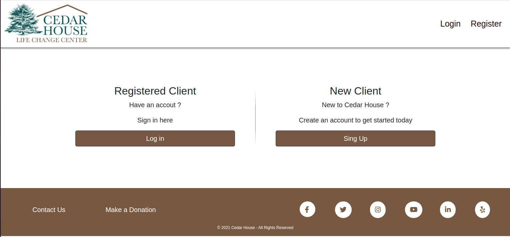
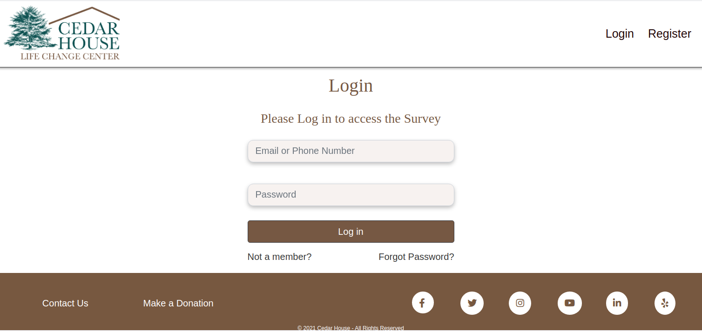
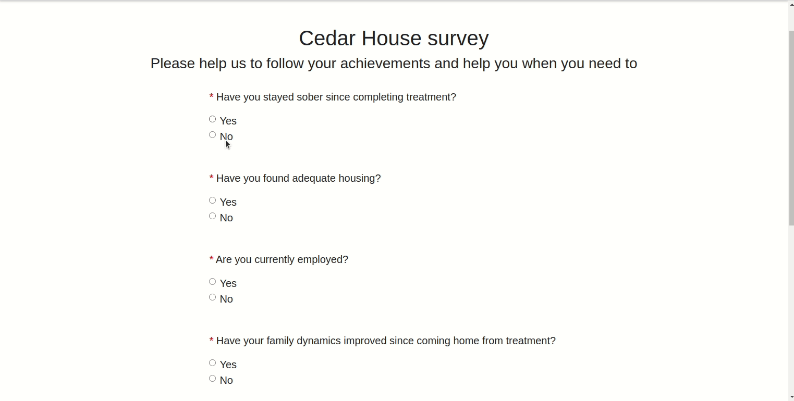
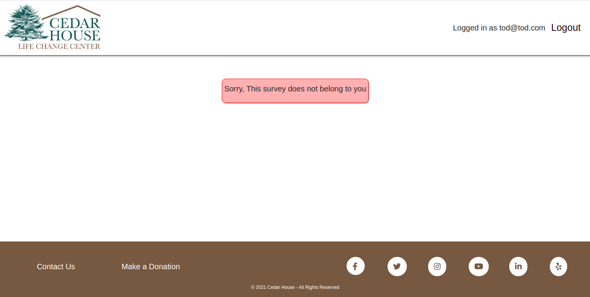

# Cedar House Alumni Follow up Survey

This was our final project during our studies at Lighthouse Labs’ Full Stack Web Developer Bootcamp.  It consists of two parts: backend (server side) and frontend (client side). The Backend is built following the RESTFull API conventions, and can be used with any custom frontend. The frontend however, for our learning purposes, was built using Reactjs. 
The app is built for cedar house a non for profit organization to aid in following up with their Alumnis health after graduating from the program.  
The purpose of the app is to send the registered alumnus notification email by the start of each month to ask them to fill the survey. In addition, the app will generate a report for the previous month summarising all responses and send the report to the admin.

## Screenshots:

- Screenshot of main page

- Screenshot of login page

- Clip of answering a survey

- Screenshot of error when accessing wrong survey

## Tech/framework used
Backend was built with:-
- NodeJs
- ExpressJs
- PostgreSQL
- Nodemailer for sending emails
- Pdf creator to generate the report.

Frontend was built with :-
- ReactJs
- Bootstrap-reactjs for styling
- React Router
 
 
## Installation

The project has 2 main folders:

 - client (React Front-End)
 - backend (Express Back-End)

 Run npm install in both folders to install the dependencies.

 To start both servers:

 `npm start` in the client folder
 
  `npm run dev` in the backend folder

- IMPORTANT: create a `.env` file with your database, gmail, and JWT secret settings. Look at .env.example for usage.

## Features
 
- Backend (server side): 

The backend is responsible for the following: 

1. Login/register users
2. Sending the survey questions to browser.
3. Saving the survey responses to the database
4. Authentication and authorization of users.
5. Sending email notifications.
6. Sending the report to the admin.

- Frontend (client side):

The frontend is built in a way to restrict access to a survey/:id to logged in users only. 

Also, there is a follow up question to question 1 that only is shown when a user answer with No. otherwise it is hidden. 

## Other possible features to be added: 
- Adding a graph to the generated report
- Adding the forget password mechanism
- Adding client profile to list all the their information and to previous surveys.
- Adding an admin profile page to get quick access to the clients (users) info and reports. 
	
## License
